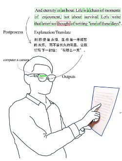
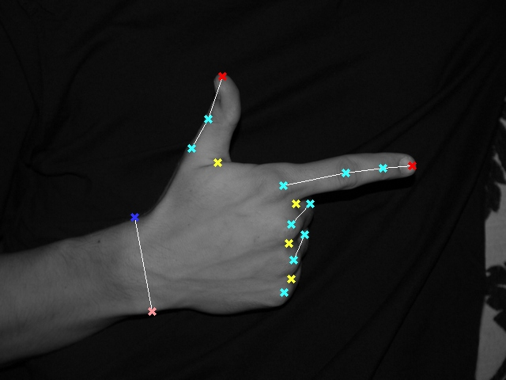

# HandFeaturePoints-DeepCNN

The handdetertor could be replaced by a trained neural net. 

Todo: use a bigger database with manually classified hand feature points to train a CNN.

Could start from this public database:

Then improve using more complicated backgrounds.
